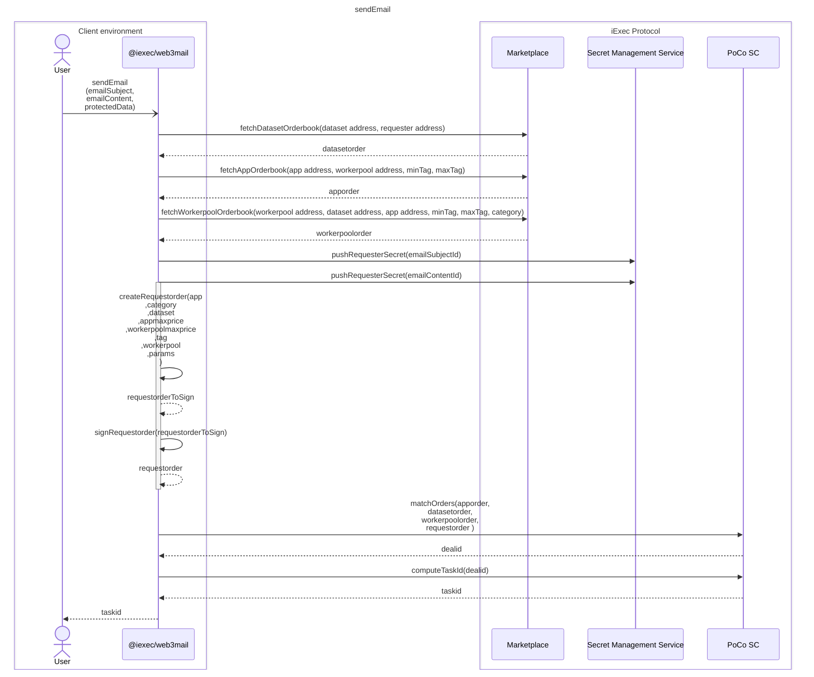

# sendEmail

```mermaid
sequenceDiagram
    title sendEmail

    box Client environment
        actor User
        participant SDK as @iexec/web3mail
    end

    box iExec Protocol
        participant Market as Marketplace 
        participant SMS as Secret Management Service
        participant POCO as PoCo SC
    end

    User -) SDK: sendEmail<br>(emailSubject,<br>emailContent,<br> protectedData)

    SDK ->> Market: fetchDatasetOrderbook(dataset address, requester address)

    Market -->> SDK : datasetorder

    SDK ->> Market: fetchAppOrderbook(app address, workerpool address, minTag, maxTag)

    Market -->> SDK : apporder

    SDK ->> Market: fetchWorkerpoolOrderbook(workerpool address, dataset address,  app address, minTag, maxTag, category)

    Market -->> SDK : workerpoolorder

    SDK ->> SMS : pushRequesterSecret(emailSubjectId)

    SDK ->> SMS : pushRequesterSecret(emailContentId)

    activate SDK

    SDK ->> SDK: createRequestorder(app<br>,category<br>,dataset<br>,appmaxprice<br>,workerpoolmaxprice<br>,tag<br>,workerpool<br>,params<br>)

    SDK -->> SDK : requestorderToSign

    SDK ->> SDK: signRequestorder(requestorderToSign)

    SDK -->> SDK : requestorder

    deactivate SDK

    SDK ->> POCO: matchOrders(apporder,<br>datasetorder,<br>workerpoolorder,<br>requestorder )

    POCO -->> SDK : dealid

    SDK ->> POCO: computeTaskId(dealid)

    POCO -->> SDK : taskid

    SDK -->>User: taskid

```

[<-- back](../index.md)
