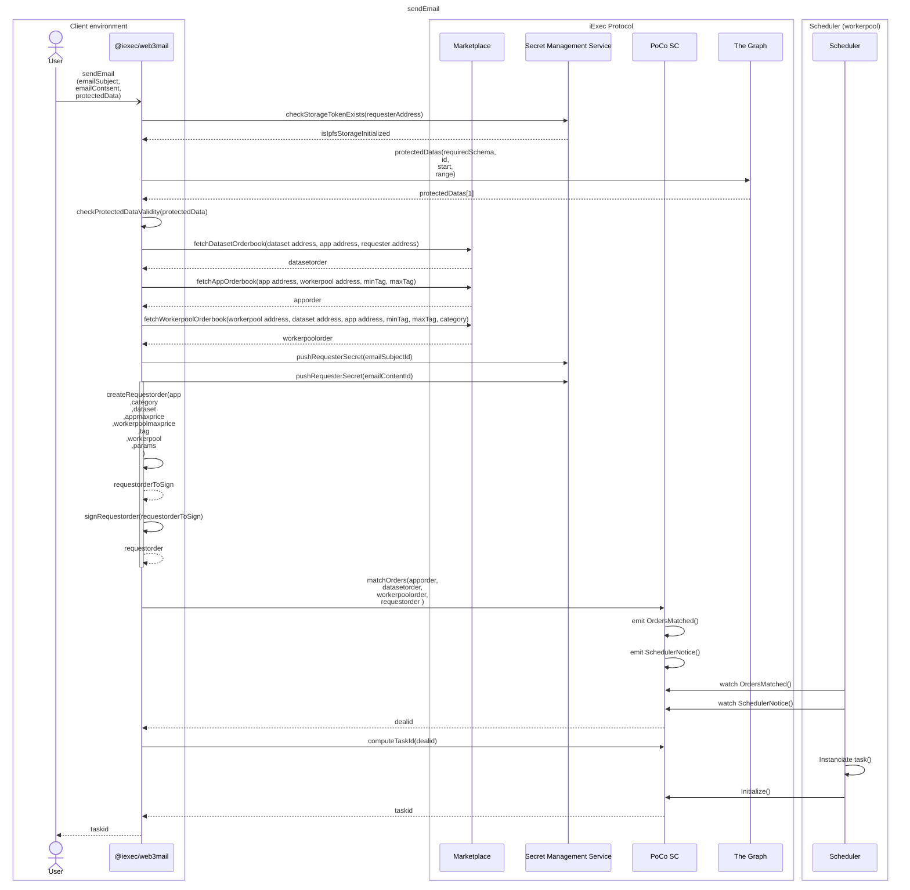

# sendEmail

```mermaid
sequenceDiagram
    title sendEmail

    box Client environment
        actor User
        participant SDK as @iexec/web3mail
    end

    box iExec Protocol
        participant Market as Marketplace 
        participant SMS as Secret Management Service
        participant POCO as PoCo SC
        participant Graph as The Graph
    end

    box Scheduler (workerpool)
        participant Scheduler as Scheduler
    end

    User -) SDK: sendEmail<br>(emailSubject,<br>emailContsent,<br> protectedData)

    SDK ->> SMS:  checkStorageTokenExists(requesterAddress)

    SMS -->> SDK : isIpfsStorageInitialized

    SDK ->> Graph: protectedDatas(requiredSchema,<br>id,<br>start,<br>range)

    Graph -->> SDK: protectedDatas[1]

    SDK ->> SDK: checkProtectedDataValidity(protectedData)


    SDK ->> Market: fetchDatasetOrderbook(dataset address, app address, requester address)

    Market -->> SDK : datasetorder

    SDK ->> Market: fetchAppOrderbook(app address, workerpool address, minTag, maxTag)

    Market -->> SDK : apporder

    SDK ->> Market: fetchWorkerpoolOrderbook(workerpool address, dataset address,  app address, minTag, maxTag, category)

    Market -->> SDK : workerpoolorder

    SDK ->> SMS : pushRequesterSecret(emailSubjectId)

    SDK ->> SMS : pushRequesterSecret(emailContentId)

    activate SDK

    SDK ->> SDK: createRequestorder(app<br>,category<br>,dataset<br>,appmaxprice<br>,workerpoolmaxprice<br>,tag<br>,workerpool<br>,params<br>)

    SDK -->> SDK : requestorderToSign

    SDK ->> SDK: signRequestorder(requestorderToSign)

    SDK -->> SDK : requestorder

    deactivate SDK

    SDK ->> POCO: matchOrders(apporder,<br>datasetorder,<br>workerpoolorder,<br>requestorder )

    POCO ->> POCO : emit OrdersMatched() 

    POCO ->> POCO : emit SchedulerNotice() 

    Scheduler ->> POCO : watch OrdersMatched()

    Scheduler ->> POCO : watch SchedulerNotice()

    POCO -->> SDK : dealid


    SDK ->> POCO: computeTaskId(dealid)

Scheduler ->> Scheduler : Instanciate task()

Scheduler ->> POCO : Initialize()

    POCO -->> SDK : taskid

    SDK -->>User: taskid

```

## Dapp execution

The [Email Sender Dapp](./sequence-email-sender-dapp.md) execution is triggered at the Instanciate task() step in the Scheduler.

[<-- back](../index.md)
